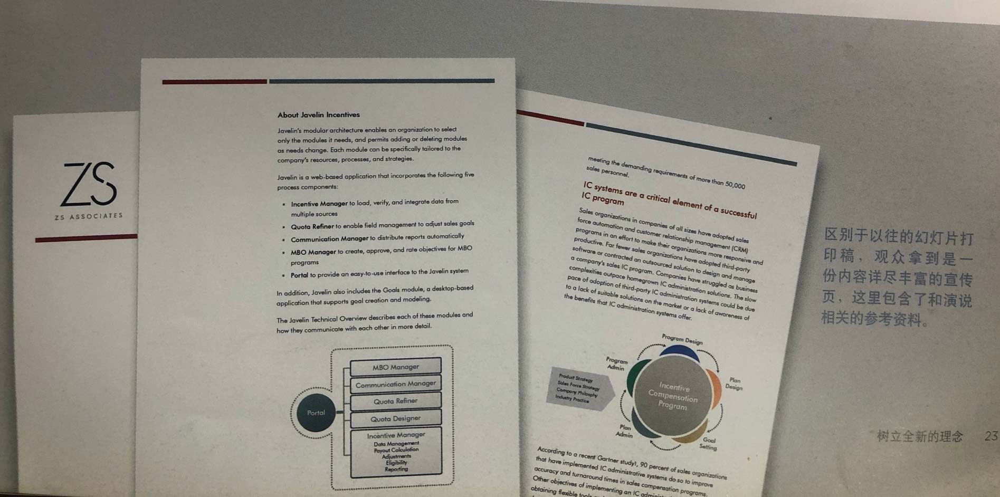
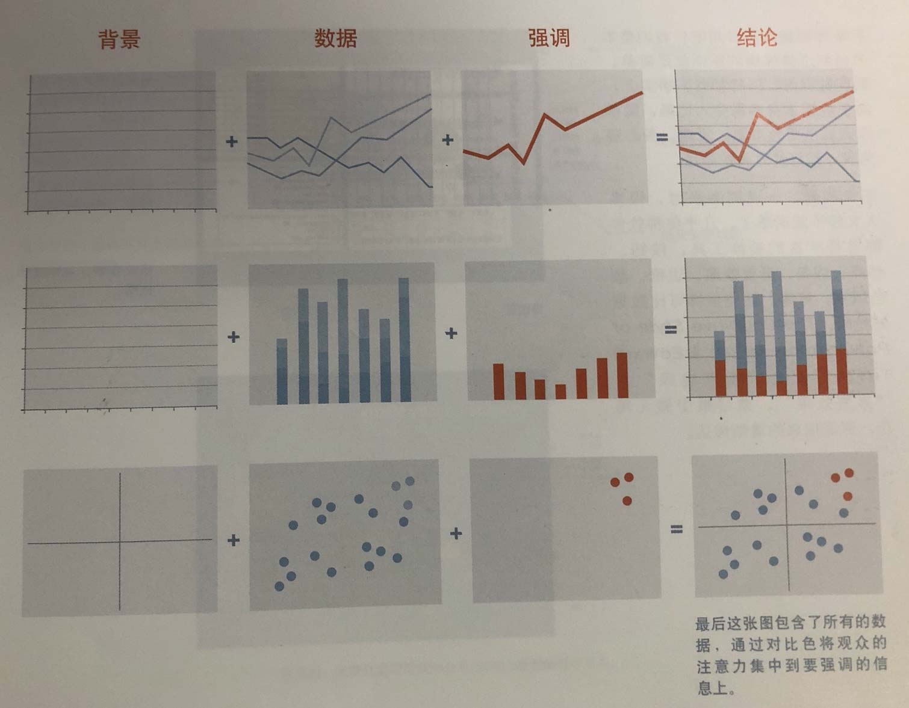
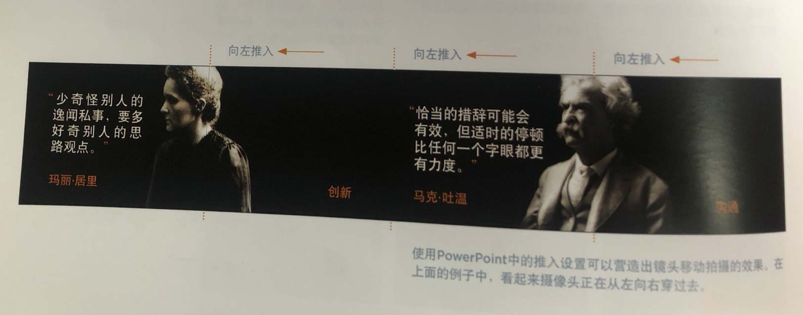

# 《演说》书摘 (slide:ology)
> 这本书主要是从如何做一个好的演说出发，阐述怎么做一份幻灯片。

这本书是在做一个项目调研的时候去读的，本身比较简短，大概半天就可以看完了，现在隔了一段时间来整理一下， 相当于重新浏览一次这本书。同时我发现有一篇豆瓣的评论是英文版的摘抄，因此我在这里摘录一些英文片段（基本就是书中的重点文字）。

豆瓣链接：[演说 (豆瓣)](https://book.douban.com/subject/10588290/)

### Chapter 1: Creating a New Slide Ideology
1. If a slide contains more than 75 words, it has become a document. 
2. Presentations with 50 or so words per slide serve as a teleprompter (自动提词器). 
3. True presentations focus on the presenter and the visionary ideas and concepts they want to communicate. 
4. The audience will either read your slides or listen to you. They will not do both. So, ask yourself this: is it more important that they listen, or more effective if they read?
5. 演说必须简单，用以支持沟通，而不是成为沟通本身
6. The presentation development process is a three-legged stool — message, visual story and delivery.
7. 演说者往往只注意到了“信息”，总是照着幻灯片来念，而不是花心思去想如何将内容转变成简单易懂的视觉故事，进而支撑他们的观点。
8. 演说者没有意识到观众仅仅关心演说者能为他们做什么，因此最好是事先了解观众需求，针对这样的需求来调整传达方式
9. The amount of time required to develop a presentation is directly proportional to how high the stakes are.
10. 下面是做一份30页左右、时长一小时的演说需要花费的时间：
	1. 6 - 20 小时：调研，从各渠道（网络、同事或行业）收集信息。
	2. 1 小时：建立目标观众需求图
	3. 2 小时：在便利贴上记下你的创意
	4. 1 小时：组织思路
	5. 1 小时：和同事讨论，**评估其对观众的影响**
	6. 2 小时：勾勒框架和 / 或叙事线索
	7. 20 - 60 小时：设计幻灯片
	8. 3 小时：排练！排练！排练！
11. 将演说中的利益点准确地传达到观众的心里，优秀的演说者向来是以利他而不是利己为出发点的。
12. 7 个问题了解观众：
	1. 他们是什么样的人？
	2. 他们为何来听演讲？
	3. 他们担心什么？
	4. 你有什么解决之道？
	5. 你希望他们做什么？
	6. 如果他们不认同怎么办？
	7. 怎样才能更好地和他们沟通？
13. 某个案例中：区别于以往的幻灯片打印稿，观众拿到的是一份内容详尽丰富的宣传页，这里包含了和演说相关的参考资料

### Chapter 2: Creating Ideas, Not Slides
1. Change your environment when you need to be creative.
2. 最好从纸笔开始：演示软件的本意就不是用于头脑风暴或者绘图的，最终应用仅是用来承载创意的容器，而非创造它们的目的。
3. **Continue to sketch and force yourself to think through several more ideas.** 
4. Sticky notes allow ideas to be captured, sorted, and re-arranged as needed. 
5. 一张便利贴最好只记录一个想法，使用大记号笔来书写：如果这个创意在一张便利贴都写不下时，就说明它太复杂了！
6. Sketching is the magical part of the process — taking rough ideas, find tuning them, re-organizing them, and sketching it out all over again until you can see a story. 
7. 跨文化交流的策略：
	1. 使用文化上中性的图片。与文字不同，图片是无需翻译的，尝试使用视觉元素取代项目条例式的布局
	2. 图片应该极为简单，并非所有国家都有从左到右阅读的习惯。也可以使用动画来引导用户接受信息的次序
	3. 与观众保持互动，密集的文字实际上会阻碍与观众的关联。幻灯片应该给演讲者提供一个好的结构，而不应该禁锢其风格，或让他们照本宣科。

### Chapter 3: Creating Diagrams
1. 六种常见的图形结构：
	1. 抽象概念类：
		1. 流程图：
			1. 线性流程图
			2. 环形流程图
			3. 分支、汇聚流程图
			4. 多向流程图
		2. 结构图：
			1. 矩阵结构图
			2. 树状结构图
			3. 层次结构图：依附关系、层级和顺序关系
		3. 聚集图：
			1. 重叠图（利益、责任的共享或重合等）
			2. 闭合图：格式塔理论
			3. 封闭图：表示至少有一个元素包含在另外一个中，以此表示哪些部分是独立的，哪些部分的优先级更高
			4. 链图：将相互关联的元素统一起来
		4. 发散图：
			1. 点源发散图
			2. 核心发散图：主从关系
			3. 中心发散图：若即若离（没有核心），围绕一个区域向外发散。
	2. 实际概念类：
		1. 图解：
			1. 过程图：展现产品如何运作
			2. 透视图：切分、剥离等展示内部工作状态
			3. 方向图：通常标有起点、终点和方向
			4. 位置图：地理位置
			5. 作用图：展示不同物体相互作用产生的效果
		2. 数据展现：
			1. 对比图
			2. 趋势图
			3. 分布图
2. 综合使用图表可以用来表示更复杂的概念

### Chapter 4: Displaying Data
1. 演说中要展现数据时，一定要遵守的最重要法则：清晰！
2. 数据展现的重点不在于数据本身，而在于数据要传达的含义
3. 幻灯片通常不适合用来展示复杂的数据，如果真的有必要让观众细读数据并从中得出自己的结论，那么最好还是提供打印稿。
4. Five Data Slide Rules:
	1. Tell the truth
	2. Get to the point
	3. Pick the right tool for the job
	4. Highlight what’s important
	5. Keep it simple
5. 此外要保证所展示的数据都有据可查。
6. 要有效地传递数据信息，首先必须想清楚希望观众接受什么样的结论，然后再设计展示的方式
7. 标注重点：背景、数据、强调、结论

### Chapter 5: Thinking Like a Designer
1. Designing Effective Slides:
	1. Arrangement:
		1. Constrast 对比
		2. Hierarchy  层次
		3. Unity 一致
		4. Space 空间
		5. Proximity 间距
		6. Flow 流程
	2. Visual Elements
		1. Background
		2. Color
		3. Text
		4. Images
	3. Movement
		1. Timing 
		2. Pace 节奏
		3. Distance
		4. Direction
		5. Eye flow

### Chapter 6: Arranging Elements
1. Placement of Elements Creates Meaning
	1. 对比：观众可以迅速定位重点
	2. 流程：观众了解信息传达的次序
	3. 层次：观众可以看到元素之间的关系
	4. 一直：观众明白信息之间的一致性
	5. 距离：观众从元素的分布中理解其意义
	6. 留白：给观众留下视觉上的呼吸空间
2. Overcrowding the slides doesn’t add to the clarity of the message. 
3. 对比：原则是产生明确、有效和**最小化**的对比
4. 设计不是装饰、设计是尽可能让沟通变得更容易、更清晰

### Chapter 7: Using Visual Elements: Background, Color, and Text
1. 背景：创造场景（**创造空间感**）
2. 颜色部分跳过
3. 三秒定律：试问自己能否在 3 秒内有效传播信息
4. 除非能提升价值、内涵或者感情，否则不要滥用动画效果
5. 慎用项目符号（Bullet Point）！
6. Bullet Laws
	1. Protect audience
	2. Use sparingly
	3. Write headlines
	4. Use parallel structure 
	5. Avoid sub-bullets
7. 幻灯片开头使用一段简单的循环动画是一个不错的想法

### Chapter 8: Using Visual Elements: Images
1. 等距设计：没有没影点，可以随意摆放而仍然像是在同一个平面（2.5d）
2. 图解复杂的故事

### Chapter 9: Creating Movement
1. If you choose to use animation, it should look natural and alive. 
2. The movement of object should seem familiar and make sense. 
3. 确保演说与幻灯片同步：观众会本能地扫视幻灯片的内容，因此将无关的内容隐藏起来，保证观众的焦点在当前内容上。
4. Animation uses motion, speed, and direction for these purposes:
	1. Change in Relationship
	2. Direction
	3. Change in Object
	4. Sequence
	5. Emphasis
5. 全景设计

6. 借用隐喻：模仿物理上开锁过程等

### Chapter 10: Governing with Templates
Pass

### Chapter 11: Interacting with Slides
1. 3R 定律：Reduce, Record and Repeat
	- 熟练幻灯片内容能让我们更容易删除多余的文字和内容
2. 剩下关键字，或用图片代替关键字
3. 有意识地限制时长，如果有多余的时间可以用问答代替
4. 相信自己可以少用幻灯片。善用 B 键和 W 键，迫使观众将视线转移到你身上
5. 演说中的停顿，可以强化气场，烘托即将出炉的演说内容的重要性。
6. How many slides? Use the 10/20/30 Rule: A PowerPoint presentation should have 10 slides, last no more than 20 minutes, and contain no font smaller than 30 points.
7. 但是数量不是绝对的，取决于风格
