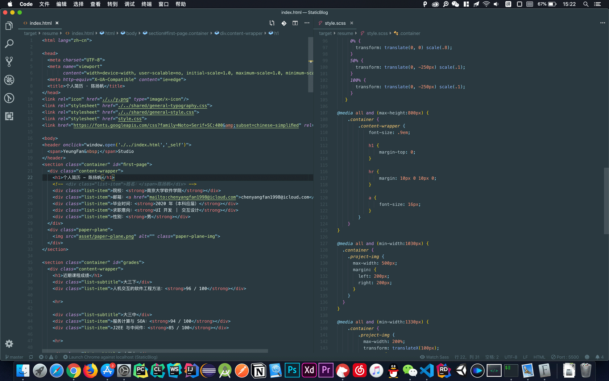
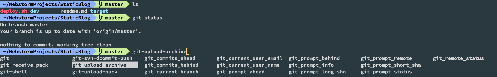
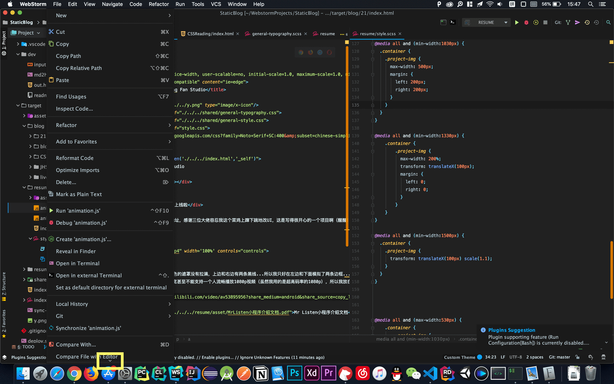
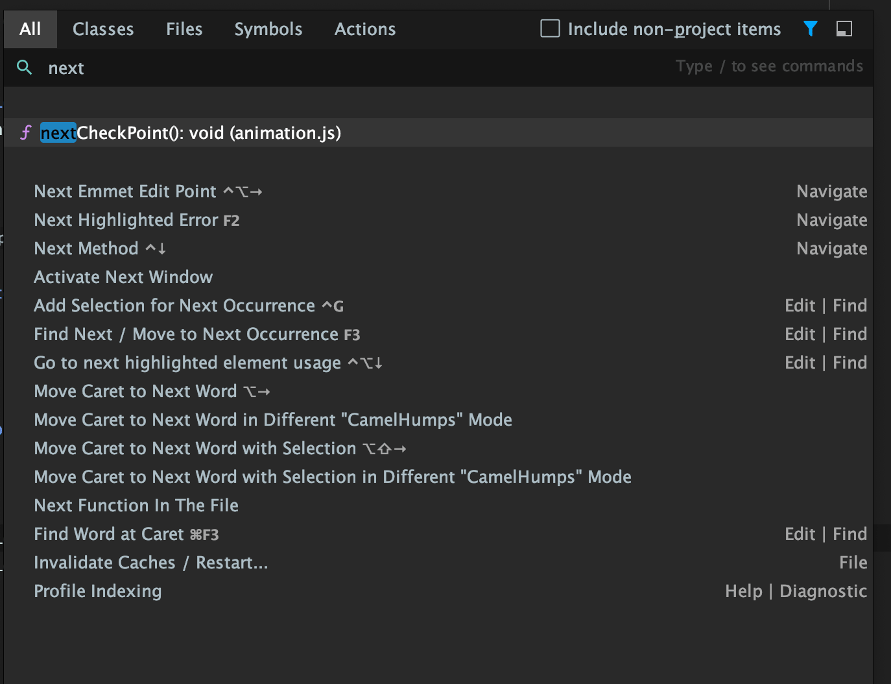
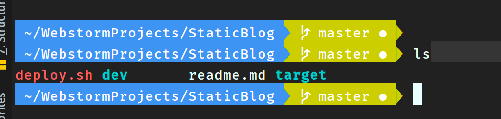

# IDE 折腾之旅
> 本文主要是讲在5天内经历 WebStorm / IDEA -> VSCode -> WebStorm -> VSCode 是怎样的感受以及一些我认为很好用的小技巧或快捷键分享（毕竟在下并没有技术干货）

## 为什么要尝试VSCode
1. 首先最大的原因是 VSCode 近两年持续不断的热度，虽然在此之前 VSCode 一直是电脑里的常备软件，但最大的用途是拿来看代码，因为 VSCode 真的是秒开，加上基本所有语言都有代码高亮，拿来看看代码是很棒的。
2. 尝鲜，暑假真的挺无聊的，找点事情做也是挺好的。

## VSCode 的第一次尝试
#### 插件篇
1. VSCode 本质上还是比较像是一个编辑器而不是集成开发环境，如果要拿来当作生产环境，需要根据需要装很多插件。
2. 随着 VSCode 的更新，有些插件被默认集成在 VSCode 里面了，因此网上很多资料都有点过时，下载的时候需要鉴别一下。
3. 插件一览：（目前总共装了14个插件）
	1. Beautify：前端代码格式化插件，另一个比较出名的是 Prettier，两个我都下载下来试过了，最终选择 Beautify 的原因是因为它格式化的破环程度比较小，而 Prettier 格式化前后的变化非常大，在写代码的时候相对会更扰乱思路。
	2. Auto Rename Tag：很小的工具，在`
lorem
`中编辑前面的div标签后面的闭合标签也会更新（吐槽：这不应该是自带的吗喂）
	3. Better Comments：注释里 todo 之类的字样高亮（再次吐槽）
	4. Bracket Pair Colorizer 2: 用来给不同层级的括号渲染不同的颜色，还挺好的。
	5. Chinese (Simplified) Language Pack for Visual Studio Code：简体中文支持，虽然一些看惯了的命令中文看起来更迷惑，但是像搜索、设置快捷键之类的还是很方便的
	6. CSS Navigation：在 HTML 中按住 command 点击类名等查找相关的定义（喂！这不也应该是自带的吗），对比几个类似的工具后应该这个是对 SASS 支持最好的
	7. Debugger for Chrome：神器，断点调试等。
	8. GitHistory: Git 增强工具，历史记录，比较等等，没啥好说的
	9. GitLens：也是Git相关，其实和上面的一起用之后都有点分不清功能到底是哪个提供的…可能到时候搞清楚了要删掉一个
	10. Live Sass Compiler：监听SCSS 文件变化，然后编译CSS用的
	11. Live Server：在浏览器同步更新代码，速度很快，体验优秀
	12. Material Theme：神器，各个主题效果非常漂亮，但是 icon 比较花哨，还是还原成默认的 icon 了

	13. open in browser：简单预览一下 html 文件用的，好像其实没什么用。
	14. TS/JS postfix completion：postfix这个功能貌似是 Jetbrains 家提出来的（不确定），具体就是说编写代码时用 `foo.bar < 10.if`、`foo.log`然后按tab补全，就会生成`if (foo.bar) < 10 )`、`console.log(foo)`这样的代码。有一些情况下知道有这种用法可以更灵活，不用翻回去插入一些字符（也就是习惯了WebStorm）
	15. （IntelliJ IDEA Keybindings）：快捷键绑定改为与 JetBrains 系列类似，其实蛮好用的，但是觉得既然换了 IDE 就还是试一下官方编制的那一套。

#### 番外：终端篇
终于装了 zsh，各种人性化的提示和良心 UI，真实解放了短时记忆力为 0 的苦孩子的脑力负担 TAT（图为 VSCode 里的终端）

#### 弃坑篇：为什么又倒戈了 WebStorm 了？
1. 其实从下载的插件就能看出一些端倪，因为太熟悉那一套了，很多时候都会理所当然地想：不是本来就应该有这种功能吗！？然后开始装插件，可是有些功能并没有现成的插件，像是巨好用的command shift enter（Complete Current Statement 自动完成当前语句），强烈建议不知道的同学尝试一下。
2. 貌似毕业之后还能继续免费用 JetBrains 全家桶（就算不能继续免费用，写 **Java**、C++、python 估计还是会去买 JetBrains ）
3. 发现 WebStorm 插件系统里有 Material Theme！

## WebStorm 真香
1. 装了 Material Theme 后的界面如图所示，比起原先的UI好看不少，注意设置时可以选择菜单密度，最好是设置近一些提高效率，不然一屏放不下（黄框）

2. 回归强大的代码提示、补全、导航等等，重新拥有了发掘很多潜在功能的可能性，还是很感动的
3. 另外去找资料整理了一下快捷键： [请自备科学上网技能](https://www.youtube.com/watch?v=o-T40MRwzdA) ：

#### JetBrains快捷键篇
> 这里只列出了一些比较有趣或原先不熟悉的快捷键，上面的视频很详细，如果有兴趣可以去看那个视频
1. double shift：全局搜索，包括文件、方法、设置、动作等等等等，基本上想要什么操作打开输入就好了。
 
2. command shift A：其实就是上面打开的窗口的Actions一栏
3. 命令缩写：一些比较繁琐但是低频的操作如果不想设置快捷键，可以设置一个缩写命令，然后使用 command shift A 、键入缩写命令，就可以执行了（Keymap -> add abbreviation）
4. command E 文件导航，暂时有点用不惯。
5. 有个命令叫做 select in project view 就可以通过添加缩写的方式快速调用，找到目前活跃窗口在 Project 一栏的位置
6. postfix：上面有介绍过，可以尝试一下
7. option /：选择可能的词汇（可以在字符串中用）
8. command shift enter：神器，再次强调
9. inject language：语言中内嵌语言，像是SQL、JSON等等，option enter就可以调用
10. shift control J：合并行，特定时候应该挺有效率的。
11. search template：代码重构、审查神器
12. debug 模式下可以添加 wacth，自定义规则，避免影响代码
13. 有一个 steam 调试工具，我猜 WebStorm 也会有类似的，看起来很棒

## WebStorm再次弃坑
#### 直接原因：
1. 内嵌的终端这个三角显示实在是改不动（并不是行高的问题），虽然这也是内嵌终端可配置项太少的锅，尝试几个小时发现无法修复后毅然决然决定每次都打开 iTerm 取代内置终端

2. 自带的Live Edit功能对js的支持一言难尽（我觉得我应该设置得没问题）：这个功能就相当于 VSCode 插件的Live Serve，监听文件变化来更新浏览器程序，对于HTML、CSS支持都很好，但是对于js，只有更新像定时器、事件处理器等等才会更新逻辑，像是`console.log(1)`改动1是不会更新的，这个很奇怪，因为所有例如更改初始条件的操作，需要手动刷新，自动更新的有时候不放心还是要手动刷新，我还一直以为是我配置的问题，昨天整了好久发现就是这样的逻辑，把朕气笑了，虽然现在都用前端框架，CLI 都支持热更新代码，但是写原生js还是很苦逼，希望是我设置错了以后能改过来吧。
3. 看了这个视频：[Vue Workshop: Advanced Features from the Ground Up](https://www.bilibili.com/video/av51444410?from=search&seid=16068838642037847083)，是 Vue 的作者讲的，里面就有大段大段他用 VSCode 编辑的场景，发现他在使用工具的时候思维非常连贯，而且很少有很复杂的操作，只是几个简单快捷键非常熟练的运用，写代码的时候非常专注，我觉得这真是一个很理想的状态。
4. 那么就模仿一下！不要再试图偷懒，少打几个字母如果是用几次轻微的打断换取的，也是很不值得的。从提升专注能力这个角度，适当功能增强的文本编辑器可能是一个很好的选择，因此再尝试一下吧！

## 使用 VSCode 现状
**没有什么现状…仍然处于“woc 这个功能不应该是自带 / 那样子的吗”这种不停吐槽的阶段，希望不要再决定跳回 WebStorm 去…**

**= =**

---
来自未来的更新：WebStorm 真香...

