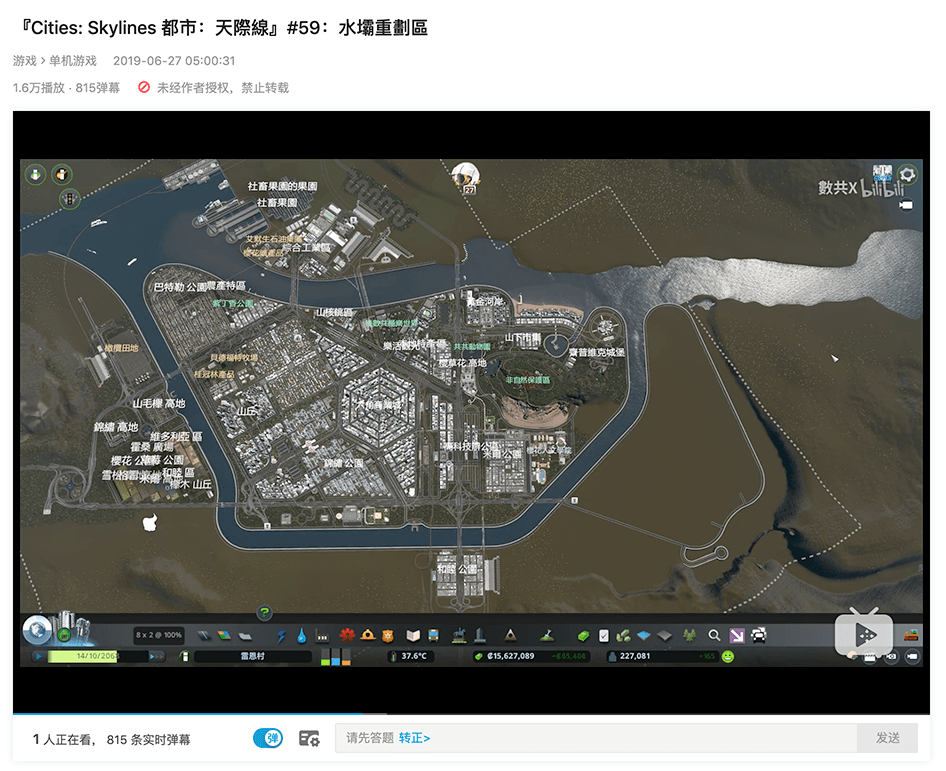

# 第三版博客系统它来啦 - 1. 杂谈
> 本文不涉及技术细节，请放心食用

## 都市：天际线 & 本项目
「都市：天际线」是个很有趣的游戏，暑假的时候闲着没事干就去 b 站找游戏录播，看看别人是怎么玩的，比如说：
1. 城市造景：[别人家的天际线，建一个阶梯城市](https://www.bilibili.com/video/av12256662?from=search&seid=17079814805843107184)
2. 造景立交系统：[【都市天际线-路口】高峰期环岛车流](https://www.bilibili.com/video/av12635958?from=search&seid=5184528055240533064)
3. 各种十字路口/立交效率对比：[【都市天际线】看看天才设计师们是如何解决交通拥堵的](https://www.bilibili.com/video/av18735187/?spm_id_from=333.788.videocard.2)
4. 令人迷惑的车流漩涡：[【都市天际线】- 这车流看着真爽](https://www.bilibili.com/video/av18248384/?spm_id_from=333.788.videocard.1)
5. （！这都行）重庆黄桷塆立交复刻：[【都市天际线】史上最复杂立交桥：重庆黄桷塆立交 1:1复制展示](https://www.bilibili.com/video/av11232084/?spm_id_from=333.788.videocard.8)
6. 以及看了整整两天的建了62集还没有堵车的一个 up 主：[數共X的个人空间 - 哔哩哔哩 ( ゜- ゜)つロ 乾杯~ Bilibili](https://space.bilibili.com/349902979?spm_id_from=333.788.b_765f7570696e666f.1)

其中感慨最深的是没日没夜刷了两天的这个录播，因为这种从零开始，一步步规划、建造成一个非常复杂又有序的系统的感觉真的很棒（虽然只是看别人玩），而且 up 在城市扩张过程中没有大规模的拆迁，有点像另一个我很喜欢的游戏 mini matro（迷你地铁） 的极限模式 —— 已建成的路线不能变更，这种没有多少回头路的设定才是真实世界中的常态，才使得游戏充满挑战性。面对复杂系统的权衡和折中的决策过程是非常有挑战性非常吸引人的。而这种系统最终所具有的复杂又有序的的结构本身也很有美感。

不过这个博客并不复杂 🙃 甚至有点幼稚

另外对比 01 集和 60 集，其中的时间跨度超过了一年，在 01 集的时候，谁也想不到 60 集的城市会是什么样子的。如果是我我就会很困扰，我会觉得如果没有一个很好的计划，没有很好的游戏水平，怎么能把城市规划得尽可能好呢？进而我在做任何决定的时候，我估计都会畏首畏尾，纠结于所有的后果，沉溺于想象更好方案，这真是一个致命的弱点啊……反观 up，虽然他水平肯定不差，但是也绝对不能预见所有决定的后果，也肯定有比他所做出的决定更好的选择。但是最终的效果却非常棒，各个部分虽然并不是都非常完美，整个系统运行时仍然有那种令人惊叹的精密有序的感觉。

这就让我觉得，应该在充分准备后，直接做能做的最好的方案，不要再去害怕后果、再去幻想更好的方案了。

因此在暑假的尾声，在决定重做博客后，用了 gulp 又在幻想 webpack 是不是更好的时候，这样的想法最终促成了这样的博客，最近三四天写代码的时候，这种不再畏首畏尾，果断决策的过程，虽然还是导致了一些耦合问题、目录结构缺陷，但是成果其实还是非常棒的，整个过程也很开心（？），这才是纯粹的创造的快乐嘛！

 
