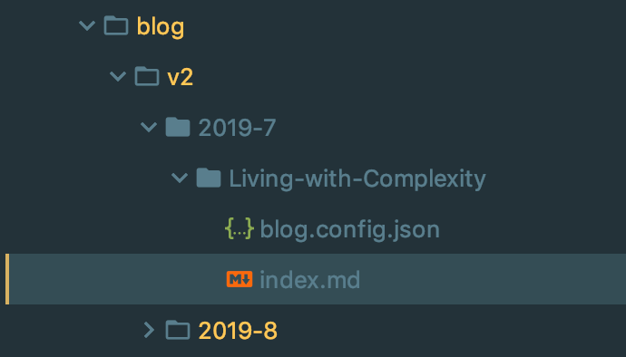
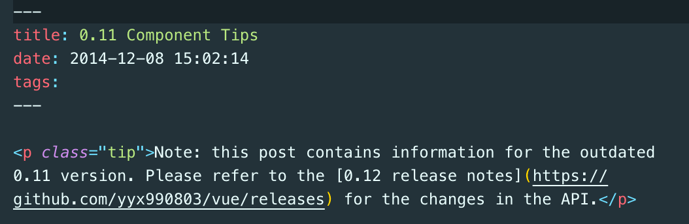
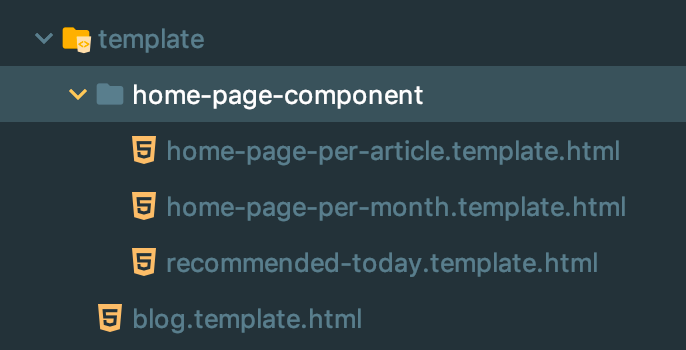
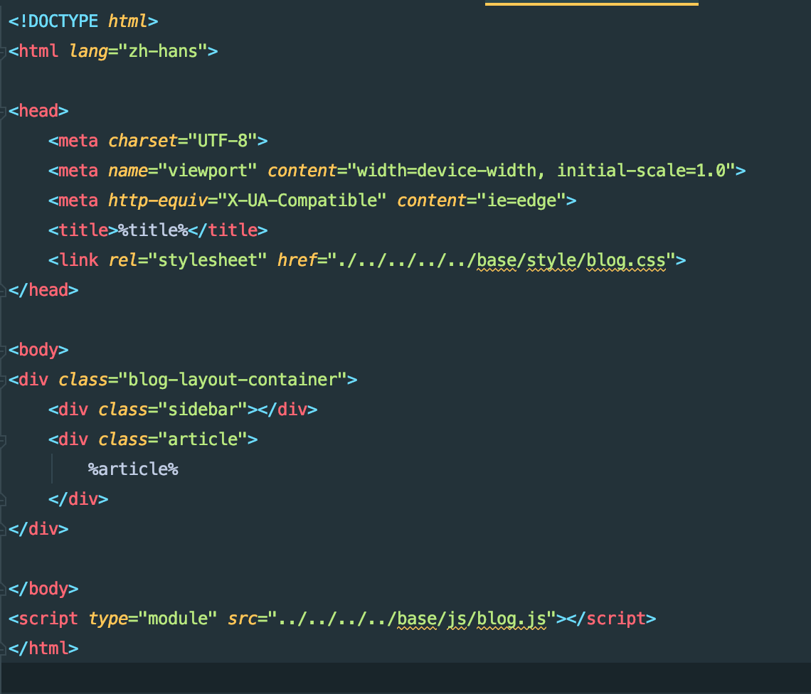
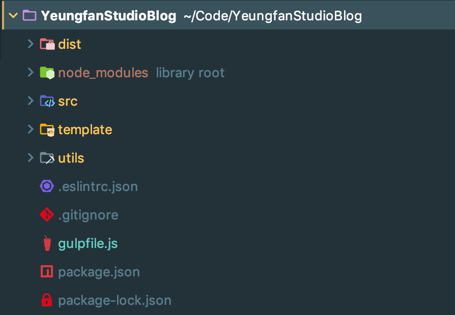
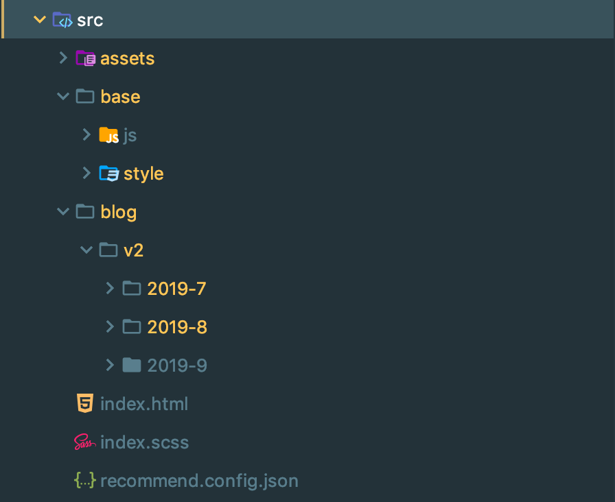
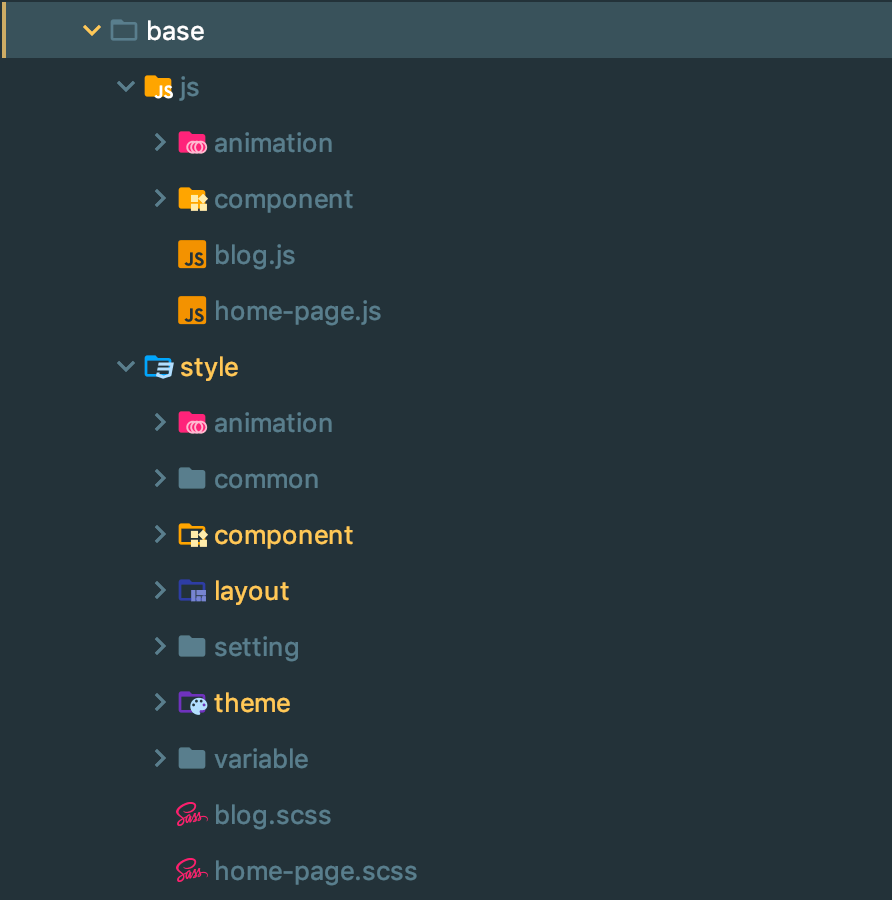

# 第三版博客系统它来啦 - 2. 项目细节
> 本文全是辣眼睛的细节，请谨慎阅读

## 为什么又要写新的博客
先回顾前面两版博客：
1. 第一版是去年 10 月份左右写的，主要是因为做了两三个项目有点兴奋，用的也是写项目的时候用惯了的 Angular，当时做第一版博客主要是想试试看不引入 UI 框架能做到什么程度，后来废弃的原因是因为后台用了数据库，写的管理系统实在是太难用了
2. 第二版是今年 4 月份做的，这一版博客非常简陋，主要是使用几个 shell 脚本，配置 nginx 做了一个完全静态的博客，现在决定废弃是因为全静态虽然在访问浏览的时候很方便，但是在编写的时候总是需要做很多复制粘贴的事情。

因此第三版博客的初衷就是为了解决这种上古时代编写 web 页面常用的复制粘贴带来的重复代码和重复操作，以降低维护博客的成本。

这次的解决的方案就是引入一些前端工程化的工具（gulp），来做成一个只需要编写 markdown 文件，放在正确的位置，加上一个配置文件就能自动生成主页和所有博客页面的小型框架，而博客模版、主页模版同时都是可以编辑修改的。

所以现在写博客最麻烦的就只有这个必要的配置文件了，它包含标题、摘要、作者、更新日期四个字段。作为参考，vue 官网源码（基于 hexo）采用的策略是改变 markdown 的解析规则，在 .md 文件开头编写配置信息，因此需要引入 markdown 解析器再对其进行更改，或者用 js 做一些很不直观的操作，成本还是挺高的。

本文将围绕构建过程中的几个主题来展开。

## Gulp 工程化
选用 gulp 而非主流的 webpack 的最主要原因是 gulp 的 api 设计实在是相当简洁，管道式的操作也非常直观，而 webpack…… 而且我发现好几个 UI 库都是用 gulp 作为构建工具，angular 源码中也出现了 gulp。加上这个博客项目需要自己写几个插件，webpack 的插件系统写起来目测成本太高了。

关于 gulp 的使用，可以参考：
1. 官网： [https://gulpjs.com/](https://gulpjs.com/) 
2. 一篇有点过时的博客：[使用 gulp 构建一个项目](https://www.kancloud.cn/thinkphp/gulp-guide/43998) 

#### gulp 插件
1. `stream-combiner2`：watch 模式下保存文件后如果出现语法错误，有些插件会导致整个进程中止（例如 node-sass）
2. `node-sass + gulp-sass`：sass相关，npm 安装 gulp-ruby-sass 提示已经被废弃。
3. `gulp-clean-css`，压缩 css 文件，gulp-minify-css 已经被废弃
4. `gulp-autoprefixer`：添加兼容性前缀
5. `gulp-sourcemaps`：gulp 4 自带sourcemaps 支持，因此不需要安装
6. `gulp-imagemin`：压缩图片体积，压缩效果尚可，不过还是要手动 ps 比较稳
7. `gulp-html-minify`：压缩HTML……
8. `del`：删除文件
9. `gulp-markdown`：markdown 解析器
10. `browser-sync`：老牌好用，同步更新，加入gulp还不用记脚本，真好

#### gulp 脚本构建
目前的脚本仍然有些许问题，比如 scss 更新有问题（这个当时用 taro 也有问题，需要排查下是不是我的问题先…）、index页面更新滞后（可能是异步的问题）等
最终构建的 gulp 包含以下任务：
1. `clean`：清空 dist 目录
2. `js`：处理 `js` 文件，这里还没有用上webpack等等工具，因此这个博客只能用于支持 ES Module 的浏览器
3.  `scss`：编译 `scss` 文件，会跳过 `.dev.scss`后缀的文件，这个在后面的项目结构中会说明
4. `html`：处理`html`文件，会跳过`.template.html`后缀的文件
5. `md`：生成博客文章，这里用到了自己写的 md-to-blog 插件
6. `image`：处理图片
7. `reload`：刷新浏览器
8. `build-index-page`：根据`blog/v2/`下的文件目录层级以及所有`blog.config.json`文件来生成主页
9. `build`：以上脚本的并行执行（一次性）
10. `default`：先执行 `build`，然后监听文件变化刷新浏览器

使用上，运行`gulp`命令即可开始编写博客，或者编写完执行`gulp build`生成静态的所有博客页面

#### gulp 插件
两个插件大同小异了，就是通过在 *.template.html 中预留`%slot%`字样，然后将内容插入而已，`template`目录如下：

以`blog.template.html`为例，内容如下：

现阶段几个需要解决的问题：
1. 这个 `href`写法非常难看
2. 没有自定义空间，应该通过检查目录中有没有 `.css`文件来自动引入，等有需求了再添加这个功能吧

至于插件的编写，只是一些简单的文件读取等等，原理上只是字符串替换，没有任何高级操作，鉴于最终每次执行时间很短没有性能问题，性能优化方面可以不考虑，因此以`config-to-home-page.js`为例，核心部分的代码如下：

> 请不要吐槽没有任何错误处理、第一次用 node 写文件读写的奇葩风格等等问题，并且切记不要以它作为参考 

#### 项目结构
其实这次的目录结构设计有很大缺陷，因为是第一次写类似小型框架的东西，因此这次的设计只能说是一个能用的实验品。

根目录大致的结构为：

1. `dist`：处理产物文件夹
2. `template`：几个自定义插件中需要用到的模版文件，以`.template.html`结尾，通过修改这些文件来修改博客样式和主页中动态内容的样式
3. `utils`：两个自定义 gulp 插件
4. `src`：
	1. 目录结构如下

	2. 其中`js`、`style`文件夹目录结构如下：

实际上 `style` 这样的划分挺有问题的，有些文件之间耦合比较高，并且样式分散到各个小文件中，有时侯调试也比较麻烦，这些都是之后重构需要考虑解决的问题。

## 关于一些样式的反思
1. 将目录、进度条等等组件使用 js 插入到 DOM 中好处在于可以保持 `html` 文件的简洁，并且没有加载出来的后果也比较小，但是因此会有加载后闪烁的问题，虽然这个问题也比较好解决，过两天有时间再修正一下
2. 顶部进度条会让用户有困惑，因为一般这个位置的进度条是表示载入进度的，看看以后有什么想法再改进一下。
3. 移动端上左上角这个汉堡菜单中的回到主页不像是个按钮，可能之后找个合适的 icon 改造一下。
4. 组件耦合度高！（重大缺陷），写的时候没有控制好，导致 `header catalog`之间耦合程度比较大，之后重构需要着重解决
5. 鼠标移上去的`hover`效果还没想好怎么写…原先改背景的那种渐变太一般了
6. 有挺多地方的长度是调试出来的不是算出来的，对修改很不友好

## 总结
我也不知道写啥好了…这几天代码写太多了，思维混沌、手也很酸，提前批非常惨的面试过程和不确定的面试结果又让我超级焦虑..

总之这个博客像是用了四五年前的主流打包工具（gulp），用了很多十几年前 jQuery 式的操作，搭了一个勉强算是一个小框架的博客系统，

总之也就这么完结啦～之后就是小修小补的杂事，可能以后想试试一批新的东西，又没实习又没项目，就只好再拿博客开刀（没错这次也是这样）